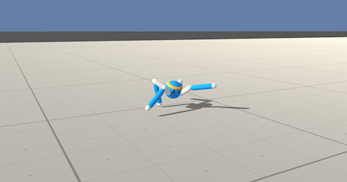

# Reacher (Continuous Control)


The goal of this project is to train an agent to maintain its position at the target location for as many time steps as possible. The simulation environment is provided by [Unity ML-Agents](https://github.com/Unity-Technologies/ml-agents).
This project was solved with a **Deep Deterministic Policy Gradients (DDPG)** algorithm.

## Overview
In this environment, a double-jointed arm can move to target locations. A reward of +0.1 is provided for each step that the agent's hand is in the goal location. 


The observation space consists of 33 variables corresponding to position, rotation, velocity, and angular velocities of the arm. Each action is a vector with four numbers, corresponding to torque applicable to two joints. Every entry in the action vector should be a number between -1 and 1.

### Distributed Training

For this project, we will provide you with two separate versions of the Unity environment:
- The first version contains a single agent.
- The second version contains 20 identical agents, each with its own copy of the environment.  

The second version is useful for algorithms like [PPO](https://arxiv.org/pdf/1707.06347.pdf), [A3C](https://arxiv.org/pdf/1602.01783.pdf), and [D4PG](https://openreview.net/pdf?id=SyZipzbCb) that use multiple (non-interacting, parallel) copies of the same agent to distribute the task of gathering experience.  

### Solving the Environment

Note that your project submission need only solve one of the two versions of the environment. 

#### Option 1: Solve the First Version

The task is episodic, and in order to solve the environment,  your agent must get an average score of +30 over 100 consecutive episodes.

#### Option 2: Solve the Second Version

The barrier for solving the second version of the environment is slightly different, to take into account the presence of many agents.  In particular, your agents must get an average score of +30 (over 100 consecutive episodes, and over all agents).  Specifically,
- After each episode, we add up the rewards that each agent received (without discounting), to get a score for each agent.  This yields 20 (potentially different) scores.  We then take the average of these 20 scores. 
- This yields an **average score** for each episode (where the average is over all 20 agents).

The environment is considered solved, when the average (over 100 episodes) of those average scores is at least +30. 

## Getting started

### Dependencies

To set up your python environment to run the code in this repository, follow the instructions below.

1. Create (and activate) a new environment with Python 3.6.

	- __Linux__ or __Mac__: 
	```bash
	conda create --name name_of_your_env python=3.6
	source activate name_of_your_env
	```
	- __Windows__: 
	```bash
	conda create --name name_of_your_env python=3.6 
	activate name_of_your_env
	```
	
2. Follow the instructions in [this repository](https://github.com/openai/gym) to perform a minimal install of OpenAI gym.  
	
3. Clone the repository and navigate to the `python/` folder.  Then, install several dependencies.
```bash
git clone https://github.com/FFOGAING/DeepReinforcementLearningProjects.git
cd DeepReinforcementLearningProjects/Banana_collector/python
pip install .
```
4. If you encounter a problem with the pytorch versions, follow this line
```bash
pip install torch==0.4.0 -f https://download.pytorch.org/whl/torch_stable.html
```

5. Create an [IPython kernel](http://ipython.readthedocs.io/en/stable/install/kernel_install.html) for the `name_of_your_env` environment.  
```bash
python -m ipykernel install --user --name name_of_your_env --display-name "name_of_your_env"
```
7. Build your own unity environemnt from the [Unity ML-Agents](https://github.com/Unity-Technologies/ml-agents) other download a already builded one with one of theses Links
- **_Version 1: One (1) Agent_**
        - Linux: [click here](https://s3-us-west-1.amazonaws.com/udacity-drlnd/P2/Reacher/one_agent/Reacher_Linux.zip)
        - Mac OSX: [click here](https://s3-us-west-1.amazonaws.com/udacity-drlnd/P2/Reacher/one_agent/Reacher.app.zip)
        - Windows (32-bit): [click here](https://s3-us-west-1.amazonaws.com/udacity-drlnd/P2/Reacher/one_agent/Reacher_Windows_x86.zip)
        - Windows (64-bit): [click here](https://s3-us-west-1.amazonaws.com/udacity-drlnd/P2/Reacher/one_agent/Reacher_Windows_x86_64.zip)

- **_Version 2: Twenty (20) Agents_**
        - Linux: [click here](https://s3-us-west-1.amazonaws.com/udacity-drlnd/P2/Reacher/Reacher_Linux.zip)
        - Mac OSX: [click here](https://s3-us-west-1.amazonaws.com/udacity-drlnd/P2/Reacher/Reacher.app.zip)
        - Windows (32-bit): [click here](https://s3-us-west-1.amazonaws.com/udacity-drlnd/P2/Reacher/Reacher_Windows_x86.zip)
        - Windows (64-bit): [click here](https://s3-us-west-1.amazonaws.com/udacity-drlnd/P2/Reacher/Reacher_Windows_x86_64.zip)

 Then, place the file in the `Reacher/` folder of the repository, and unzip (or decompress) the file.
 If you would like to train the agent on AWS, you must follow the instructions to [set up X server](https://github.com/Unity-Technologies/ml-agents/blob/main/docs/Training-on-Amazon-Web-Service.md), an then download the environment for Linux 
8. Run the `main` python file either in anaconda other in an editor of your choice (like Visual studio Code other Pycharm). Make sure to activate the virtual environment other to select the right interpreter  

	- __Anaconda__: 
	```bash
	python3 main
	
	```
	- __Visual Studio Code__: 
	  - `ctrl + shift + p` to start the  **Command Palette**
 	  - write and select the `python: select interpreter`
	  - choose the correct interpreter

## Result
The environment is solved befor the 500th episode. 


## Future Works
### Extensions

### Next Challenge: Crawler Environment


For this challenge a new Unity environement is needed
- Linux: [click here](https://s3-us-west-1.amazonaws.com/udacity-drlnd/P2/Crawler/Crawler_Linux.zip)
- Mac OSX: [click here](https://s3-us-west-1.amazonaws.com/udacity-drlnd/P2/Crawler/Crawler.app.zip)
- Windows (32-bit): [click here](https://s3-us-west-1.amazonaws.com/udacity-drlnd/P2/Crawler/Crawler_Windows_x86.zip)
- Windows (64-bit): [click here](https://s3-us-west-1.amazonaws.com/udacity-drlnd/P2/Crawler/Crawler_Windows_x86_64.zip)

A Description of the environment can be found [here](https://github.com/Unity-Technologies/ml-agents/blob/master/docs/Learning-Environment-Examples.md#crawler)

## Related Papers and references
- [Continuous Deep Q-Learning with Model-based Acceleration](https://arxiv.org/abs/1603.00748)
- [Proximal Policy Optimization Algorithms](https://arxiv.org/pdf/1707.06347.pdf) 
- [Asynchronous Methods for Deep Reinforcement Learning](https://arxiv.org/pdf/1602.01783.pdf)
- [DISTRIBUTED DISTRIBUTIONAL DETERMINISTIC POLICY GRADIENTS](https://openreview.net/pdf?id=SyZipzbCb)
- [Sharing experience](https://ai.googleblog.com/2016/10/how-robots-can-acquire-new-skills-from.html)
- [Distributed Distributional Deterministic Policy Gradients](https://openreview.net/forum?id=SyZipzbCb)
- [ Proximal Policy Optimization](https://openai.com/blog/openai-baselines-ppo/)
- [Benchmarking Deep Reinforcement Learning for Continuous Control](https://arxiv.org/abs/1604.06778)