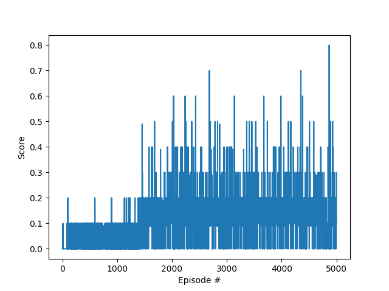

# Tennis (Collaboration and Competition)


The goal of this project is to train two agents to play tennis. The simulation environment is provided by [Unity ML-Agents](https://github.com/Unity-Technologies/ml-agents).
This project was solved with a **Deep Deterministic Policy Gradients (DDPG)** algorithm in a **collaborative fashion**.

## Overview
In this environment, two agents control rackets to bounce a ball over a net. If an agent hits the ball over the net, it receives a reward of +0.1.  If an agent lets a ball hit the ground or hits the ball out of bounds, it receives a reward of -0.01.  Thus, the goal of each agent is to keep the ball in play.

The observation space consists of 8 variables corresponding to the position and velocity of the ball and racket. Each agent receives its own, local observation.  Two continuous actions are available, corresponding to movement toward (or away from) the net, and jumping. 

The task is episodic, and in order to solve the environment, your agents must get an average score of +0.5 (over 100 consecutive episodes, after taking the maximum over both agents). Specifically,

- After each episode, we add up the rewards that each agent received (without discounting), to get a score for each agent. This yields 2 (potentially different) scores. We then take the maximum of these 2 scores.
- This yields a single **score** for each episode.

The environment is considered solved, when the average (over 100 episodes) of those **scores** is at least +0.5.

## Getting started

### Dependencies

To set up your python environment to run the code in this repository, follow the instructions below.

1. Create (and activate) a new environment with Python 3.6.

	- __Linux__ or __Mac__: 
	```bash
	conda create --name name_of_your_env python=3.6
	source activate name_of_your_env
	```
	- __Windows__: 
	```bash
	conda create --name name_of_your_env python=3.6 
	activate name_of_your_env
	```
	
2. Follow the instructions in [this repository](https://github.com/openai/gym) to perform a minimal install of OpenAI gym.  
	
3. Clone the repository and navigate to the `python/` folder.  Then, install several dependencies.
```bash
git clone https://github.com/FFOGAING/DeepReinforcementLearningProjects.git
cd DeepReinforcementLearningProjects/Banana_collector/python
pip install .
```
4. If you encounter a problem with the pytorch versions, follow this line
```bash
pip install torch==0.4.0 -f https://download.pytorch.org/whl/torch_stable.html
```

5. Create an [IPython kernel](http://ipython.readthedocs.io/en/stable/install/kernel_install.html) for the `name_of_your_env` environment.  
```bash
python -m ipykernel install --user --name name_of_your_env --display-name "name_of_your_env"
```
7. Build your own unity environemnt from the [Unity ML-Agents](https://github.com/Unity-Technologies/ml-agents) other download a already builded one with one of theses Links
    - Linux: [click here](https://s3-us-west-1.amazonaws.com/udacity-drlnd/P3/Tennis/Tennis_Linux.zip)
    - Mac OSX: [click here](https://s3-us-west-1.amazonaws.com/udacity-drlnd/P3/Tennis/Tennis.app.zip)
    - Windows (32-bit): [click here](https://s3-us-west-1.amazonaws.com/udacity-drlnd/P3/Tennis/Tennis_Windows_x86.zip)
    - Windows (64-bit): [click here](https://s3-us-west-1.amazonaws.com/udacity-drlnd/P3/Tennis/Tennis_Windows_x86_64.zip)
    

 Then, place the file in the `Reacher/` folder of the repository, and unzip (or decompress) the file.
 If you would like to train the agent on AWS, you must follow the instructions to [set up X server](https://github.com/Unity-Technologies/ml-agents/blob/main/docs/Training-on-Amazon-Web-Service.md), an then download the environment for Linux 
8. Run the `main` python file either in anaconda other in an editor of your choice (like Visual studio Code other Pycharm). Make sure to activate the virtual environment other to select the right interpreter  

	- __Anaconda__: 
	```bash
	python3 main
	
	```
	- __Visual Studio Code__: 
	  - `ctrl + shift + p` to start the  **Command Palette**
 	  - write and select the `python: select interpreter`
	  - choose the correct interpreter

## Result
The environment is solved around the 1500th episode. It is interesting to see, that despite a longer training, it is difficult for the agents to get a better and stable improvement


## Future Works
-A bigger network could be tested to see if a better result is achieved with longer training
-For this particular environment, train the agents on some sequential correlations could be maybe usefull. A possible implementation is to build two buffer for the experienced replay, one without and one with sequential correlation.
The agents should learn alternately from both.
- Other deep reinforcement learning algorithms should be also implemented.

### Next Challenge: Soccer Environment

For this challenge a new Unity environement is needed
- Linux: [click here](https://s3-us-west-1.amazonaws.com/udacity-drlnd/P3/Soccer/Soccer_Linux.zip)
- Mac OSX: [click here](https://s3-us-west-1.amazonaws.com/udacity-drlnd/P3/Soccer/Soccer.app.zip)
- Windows (32-bit): [click here](https://s3-us-west-1.amazonaws.com/udacity-drlnd/P3/Soccer/Soccer_Windows_x86.zip)
- Windows (64-bit): [click here](https://s3-us-west-1.amazonaws.com/udacity-drlnd/P3/Soccer/Soccer_Windows_x86_64.zip)

A Description of the environment can be found [here](https://github.com/Unity-Technologies/ml-agents/blob/master/docs/Learning-Environment-Examples.md#soccer-twos)

## Related Papers and references
- [Multi-Agent Actor-Critic for Mixed Cooperative-Competitive Environments](https://proceedings.neurips.cc/paper/2017/file/68a9750337a418a86fe06c1991a1d64c-Paper.pdf)
- [Training intelligent adversaries using self-play with ML-Agents](https://blog.unity.com/technology/training-intelligent-adversaries-using-self-play-with-ml-agents)

